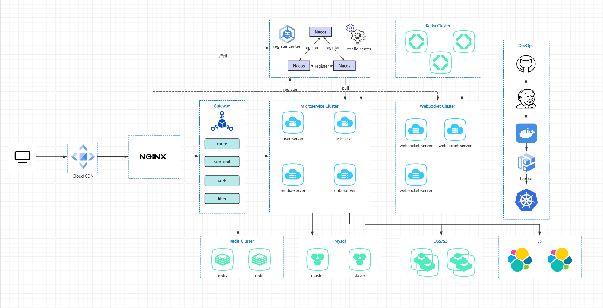
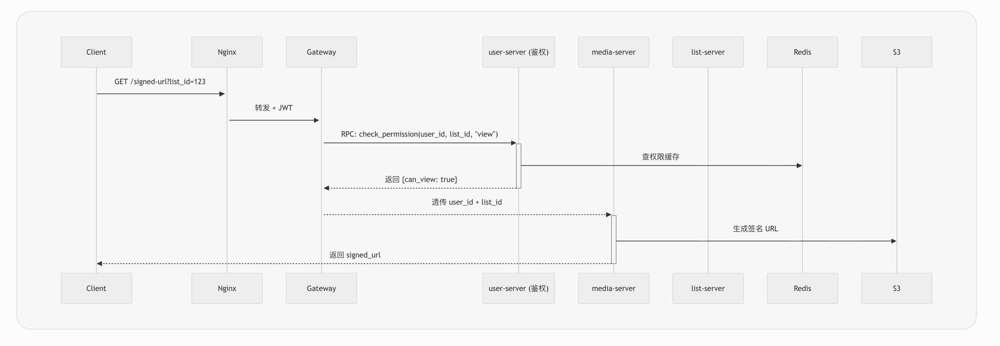
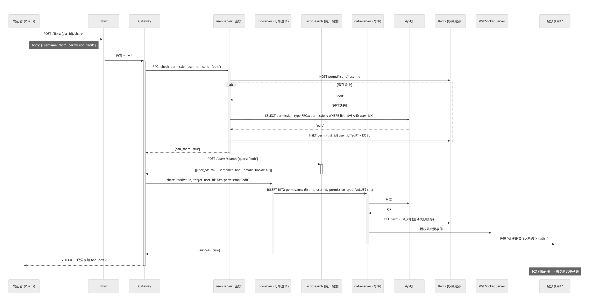
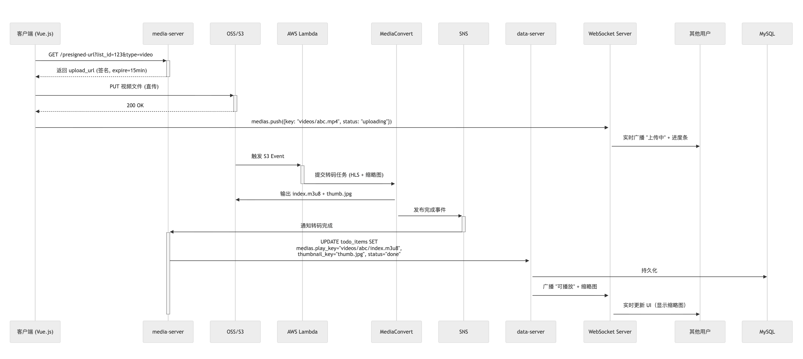
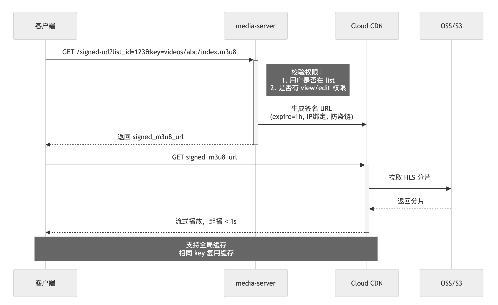

## 背景介绍
100M DAU | 约 3–10 亿用户 | 1000 人大组 | 4 分钟视频

### 1. 系统架构图


+图：系统架构图（核心组件与交互）。

### 2. 可扩展性策略

| 挑战 | 解决方案 | 预期效果 |
| --- | --- | --- |
| 100M DAU → 峰值 17 万 QPS | 64 分库 × 2000 QPS/实例 + Redis 热点缓存 | DB 实际负载 < 2 万 QPS |
| 10 亿总用户 | 64×16 分表，单表 ~1000 万行 | 写入延迟 < 10ms |
| 1000 人大组实时更新 | CRDT 客户端合并 + Kafka 分区 + 一致性哈希 | 更新延迟 < 100ms |
| 热门列表雪崩 | Redis 缓存 + TTL 1h + 写穿 | 缓存命中率 > 95% |
| 访问延迟 | CloudFront 边缘缓存 | 起播 < 1s，更新 < 100ms |

### 容量规划

| 组件 | 规模配置 |
| --- | --- |
| Spring Boot | 60 Pod |
| MySQL | 64 主 + 128 从 |
| WebSocket Server | 60 Pod（5 万连接/个） |
| Kafka | 1000 分区 |

### 3. 技术选型

| 组件 | 选择 | 理由 | 备选与权衡 |
| --- | --- | --- | --- |
| 前端 | Vue.js 3 | 响应式 + Yjs 集成好 | React：包大 |
| 后端 | Spring Boot 3 | 企业级稳定 | Node.js：并发弱 |
| 实时 | Yjs CRDT + WebSocket | 客户端合并，无锁 | OT：服务端复杂 |
| 广播 | Kafka | 按 list_id 分区 | RocketMQ：吞吐量 |
| 数据库 | MySQL 8.0 + 64×16 分片 | 单表性能最优 | TiDB：学习成本 |
| 分片路由 | ShardingSphere | 零侵入 | 手动 SQL：易错 |
| 搜索 | Elasticsearch | 中文分词 + 拼音 | Redis ZSET：不支持分词 |
| 缓存 | Redis Cluster | 权限 + 会话 | Memcached：无集群 |
| 媒体存储 | Amazon S3 | 无限扩展 | MinIO：运维重 |
| 视频转码 | MediaConvert | Serverless | FFmpeg：负担 |

### 4. 数据模型

— 用户表（64×16 = 1024 张）
```sql
CREATE TABLE db_{db_id}.users_{table_id} (
    user_id BIGINT UNSIGNED PRIMARY KEY,
    username VARCHAR(50) NOT NULL,
    email VARCHAR(100) NOT NULL UNIQUE,
    password_hash VARCHAR(255) NOT NULL,
    avatar_url VARCHAR(500),
    created_at DATETIME DEFAULT CURRENT_TIMESTAMP,
    INDEX idx_username (username)
) ENGINE=InnoDB;
```

— TODO 列表表（64 张）
```sql
CREATE TABLE db_{db_id}.todo_lists (
    list_id BIGINT UNSIGNED PRIMARY KEY,
    owner_id BIGINT UNSIGNED NOT NULL,
    title VARCHAR(100) NOT NULL,
    created_at DATETIME DEFAULT CURRENT_TIMESTAMP,
    updated_at DATETIME DEFAULT CURRENT_TIMESTAMP ON UPDATE CURRENT_TIMESTAMP,
    INDEX idx_owner (owner_id)
) ENGINE=InnoDB;
```

— 权限表（64 张）
```sql
CREATE TABLE db_{db_id}.permissions (
    perm_id BIGINT UNSIGNED PRIMARY KEY,
    list_id BIGINT UNSIGNED NOT NULL,
    user_id BIGINT UNSIGNED NOT NULL,
    permission_type ENUM('edit', 'view') NOT NULL,
    UNIQUE KEY uk_list_user (list_id, user_id)
) ENGINE=InnoDB;
```

— TODO 事项表（64 张）
```sql
CREATE TABLE db_{db_id}.todo_items (
    item_id BIGINT UNSIGNED PRIMARY KEY,
    list_id BIGINT UNSIGNED NOT NULL,
    content TEXT,  -- 可为空
    medias JSON,   -- [{id, type, key, status, thumbnail_url, play_url}]
    version BIGINT DEFAULT 0,
    updated_at DATETIME DEFAULT CURRENT_TIMESTAMP ON UPDATE CURRENT_TIMESTAMP,
    INDEX idx_list (list_id),
    INDEX idx_updated (list_id, updated_at DESC),
    INDEX idx_media_status ((CAST(medias->>'$.status' AS CHAR)))
) ENGINE=InnoDB;
```

### 5. 重点功能底层细节

#### 5.1 鉴权流程


+图：鉴权流程（三层统一：网关鉴权 → 统一校验 → 缓存）。

权限校验采用“三层统一”架构：

- 网关层（Spring Cloud Gateway）拦截所有 REST 请求，解析 JWT 获取 `user_id`。
- 统一调用 `user-server.check_permission(user_id, list_id, action)`，集中校验 `edit/view` 权限。
- 权限缓存于 Redis Hash，支持写穿 + 主动失效；在 QPS < 1000 时延迟 < 5ms。
- 业务服务（如 `media-server` 获取签名 URL）仅接收已授权请求，避免重复校验，保证高性能、一致性与可维护性。

#### 5.2 分享以及授权逻辑


+图：分享与授权逻辑（成员与权限可视化）。


#### 5.3 视频上传流程

+图：视频上传流程（直传 S3，Serverless 转码，状态广播）。

重点：
直传 S3 → 零服务器压力
实时状态 → uploading → done
serverless 转码 → Lambda + MediaConvert + SNS通知  （AWS云服务）

流程：
1. media-server 返回预签名 URL，客户端直传 OSS/S3。
2. 上传完成后通过 WebSocket 广播 uploading 状态。
3. S3 触发 Lambda，调用 MediaConvert 转码为 HLS 并生成缩略图。（AWS 云服务）
4. SNS 通知，data-server 更新 MySQL，并广播 play_url。
5. 播放通过 Cloud CDN 使用签名 URL，起播 < 1 s。
6. 上传链路对业务服务器带宽占用为 0。

#### 5.4 视频播放流程


+图：视频播放流程（动态签名 URL，IP 绑定，1 小时过期）。

不存签名 URL 
动态生成 → 每次播放都校验权限
防盗链 → IP 绑定 + 1 小时过期
CDN 加速 

## 6. 总结

该方案是基于100M DAU + 约3-10亿用户量而设计，单机房部署。
实时强：CRDT 客户端合并 + WebSocket + Kafka 大组路由
可扩展：MySQL 64×16 分表 + ShardingSphere + Elasticsearch
