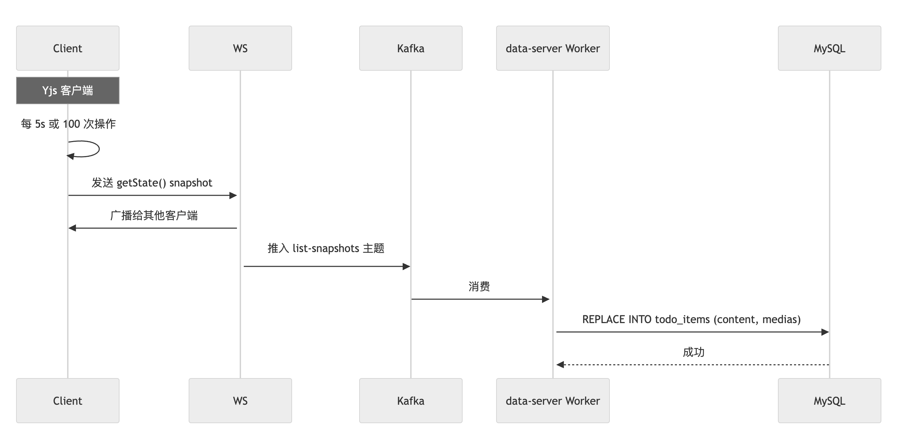
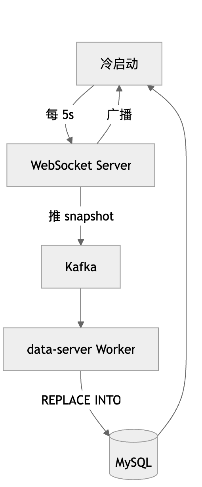

[中文](README.md) | [EN](README_EN.MD)

### 背景介绍
100M DAU | 实时更新 | 分享 | 4 分钟视频

#### 容量预估
日活一亿，假设每个用户平均操作20次，那么每日总请求量=20亿次
因为流量在24小时内并非平均分布，存在高峰时段（早上9-11点，下午2-4点），假设80%的流量请求集中在每天四个小时高峰时段。
- 高峰时段总秒数 4 * 60 * 60 = 14400秒
- 计算平均QPS(包含读和写) = 每日总请求量/86400秒 = 20亿 / 86400 ≈ 2.3w
- 计算高峰QPS
 - 高峰时段总请求量 = 20亿次 * 80% ≈ 16亿次
 - 高峰平均QPS = 16亿/14400 ≈ 11w
- 在高峰时期，可能存在瞬时流量，假设峰值是高峰时间值的2倍
 - 峰值QPS ≈ 11w * 2 = 22W


### 1. 系统架构图


### 2. 技术选型

| 组件 | 选择 | 理由 | 备选与权衡 |
| --- | --- | --- | --- |
| 前端 | Vue.js 3 | 响应式 + Yjs 集成好 | React：包大 |
| 后端 | Spring Boot 3 | 企业级稳定 | Node.js：并发弱 |
| 实时 | Yjs CRDT + WebSocket | 客户端合并，无锁 | OT：服务端复杂 |
| 广播 | Kafka | 按 list_id 分区 | RocketMQ：吞吐量 |
| 数据库 | MySQL 8.0 + 64×16 分片 | 单表性能最优 | TiDB：学习成本 |
| 分片路由 | ShardingSphere | 零侵入 | 手动 SQL：易错 |
| 搜索 | Elasticsearch | 中文分词 + 拼音 | Redis ZSET：不支持分词 |
| 缓存 | Redis Cluster | 权限 + 会话 | Memcached：无集群 |
| 媒体存储 | Amazon S3 | 无限扩展 | MinIO：运维重 |
| 视频转码 | MediaConvert | Serverless | FFmpeg：负担 |

### 3. 数据模型

— 用户表（64×16 = 1024 张）
```sql
CREATE TABLE db_{db_id}.users_{table_id} (
    user_id BIGINT UNSIGNED PRIMARY KEY,
    username VARCHAR(50) NOT NULL,
    email VARCHAR(100) NOT NULL UNIQUE,
    password_hash VARCHAR(255) NOT NULL,
    avatar_url VARCHAR(500),
    created_at DATETIME DEFAULT CURRENT_TIMESTAMP,
    INDEX idx_username (username)
) ENGINE=InnoDB;
```

— TODO 列表表（64 张）
```sql
CREATE TABLE db_{db_id}.todo_lists (
    list_id BIGINT UNSIGNED PRIMARY KEY,
    owner_id BIGINT UNSIGNED NOT NULL,
    title VARCHAR(100) NOT NULL,
    created_at DATETIME DEFAULT CURRENT_TIMESTAMP,
    updated_at DATETIME DEFAULT CURRENT_TIMESTAMP ON UPDATE CURRENT_TIMESTAMP,
    INDEX idx_owner (owner_id)
) ENGINE=InnoDB;
```

— 权限表（64 张）
```sql
CREATE TABLE db_{db_id}.permissions (
    perm_id BIGINT UNSIGNED PRIMARY KEY,
    list_id BIGINT UNSIGNED NOT NULL,
    user_id BIGINT UNSIGNED NOT NULL,
    permission_type ENUM('edit', 'view') NOT NULL,
    UNIQUE KEY uk_list_user (list_id, user_id)
) ENGINE=InnoDB;
```

— TODO 事项表（64 张）
```sql
CREATE TABLE db_{db_id}.todo_items (
    item_id BIGINT UNSIGNED PRIMARY KEY,
    list_id BIGINT UNSIGNED NOT NULL,
    content TEXT,  -- 可为空
    medias JSON,   -- [{id, type, key, status, thumbnail_url, play_url}]
    version BIGINT DEFAULT 0,
    updated_at DATETIME DEFAULT CURRENT_TIMESTAMP ON UPDATE CURRENT_TIMESTAMP,
    INDEX idx_list (list_id),
    INDEX idx_updated (list_id, updated_at DESC),
    INDEX idx_media_status ((CAST(medias->>'$.status' AS CHAR)))
) ENGINE=InnoDB;
```

### 4. 重点功能底层细节

#### 4.1 鉴权流程


权限校验采用“三层统一”架构：

- 网关层（Spring Cloud Gateway）拦截所有 REST 请求，解析 JWT 获取 `user_id`。
- 统一调用 `user-server.check_permission(user_id, list_id, action)`，集中校验 `edit/view` 权限。
- 权限缓存于 Redis Hash，支持写穿 + 主动失效；在 QPS < 1000 时延迟 < 5ms。
- 业务服务（如 `media-server` 获取签名 URL）仅接收已授权请求，避免重复校验，保证高性能、一致性与可维护性。

#### 4.2 分享以及授权逻辑


#### 4.3 视频上传流程


优点
- 直传 S3 → 零服务器压力
- 实时状态 → uploading → done
- serverless 转码 → Lambda + MediaConvert + SNS通知  （AWS云服务）

详细流程：
1. media-server 返回预签名 URL，客户端直传 OSS/S3。
2. 上传完成后通过 WebSocket 广播 uploading 状态。
3. S3 触发 Lambda，调用 MediaConvert 转码为 HLS 并生成缩略图。（AWS 云服务）
4. SNS 通知，data-server 更新 MySQL，并广播 play_url。
5. 上传链路对业务服务器带宽占用为 0。

#### 4.4 视频播放流程


优点
- 不存签名 URL 
- 动态生成 → 每次播放都校验权限
- 防盗链 → IP 绑定 + 1 小时过期
- CDN 加速 

#### 4.5 CRDT 持久化





详细流程：

1. 客户端 Yjs 每 5 秒或 100 次操作，调用 getState() 生成 snapshot → 推送 WebSocket Server；
2. WebSocket Server 转发 + 推 Kafka（list-snapshots 主题，按 list_id 分区）；
3. data-server Worker 消费 Kafka，直接 REPLACE INTO 覆盖 MySQL；
4. 冷启动：客户端从 MySQL 加载最新 snapshot → Yjs 恢复。 

优点
- 零服务端逻辑：不解析 CRDT
- 低内存：无影子文档
- 高可用：Kafka 持久化
- 冷启动快：直接加载最新 snapshot

## 5. 风险点

1. 客户端推送 snapshot 丢失，增加重试
2. Kafka 分区热点
   热点告警，手动/自动扩容，热点列表拆分(新增用户id/时间戳进行分片)
3. Redis 内存爆炸，热点key。
   实时监控，本地缓存，更精准的数据预估
4. 容量预估需要结合真实场景进行
5. 压测要全面


## 6. 总结
本方案以 Yjs 客户端 CRDT + 双网关隔离(业务网关，webSocket网关) + 64×16 分片 + serverless 媒体流 + JWT 短效期 + Redis 缓存控制 为核心，
在 100M DAU、1000 人大组、≤4 分钟视频、实时编辑立即可见 的严苛要求下，
实现了 低延迟、高可用、可扩展、安全合规（防盗链 + 登出即失效） 的设计


