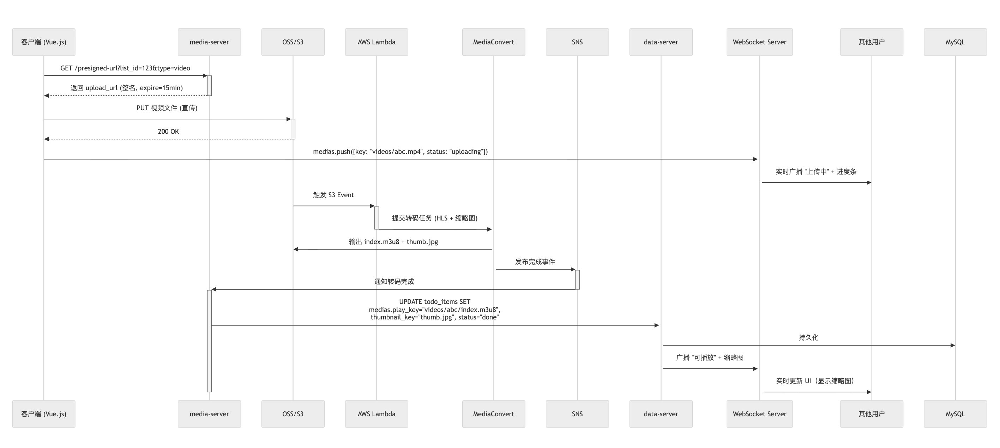
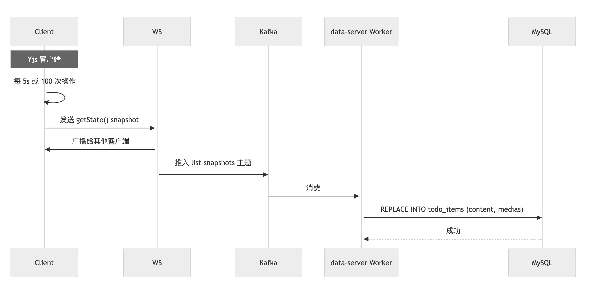
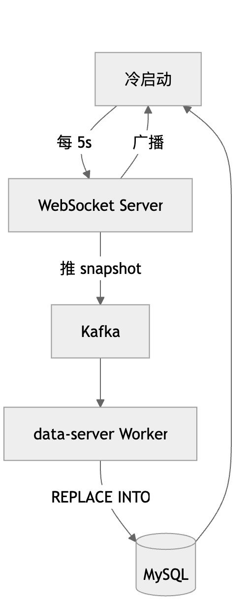

### Overview
100M DAU | ~0.3–1.0B users | 1,000-person groups | 4-minute videos

### 1. Architecture Diagram


### 2. Scalability Strategies

| Challenge | Solution | Expected Result |
| --- | --- | --- |
| 100M DAU → peak 170k QPS | 64 DB shards × 2000 QPS/instance + Redis hot-key cache | DB effective load < 20k QPS |
| 1B total users | 64×16 table sharding, ~10M rows per table | Write latency < 10 ms |
| Real-time updates for 1,000-member groups | Client-side CRDT merge + Kafka partitioning + consistent hashing | Update latency < 100 ms |
| Hot list avalanche | Redis cache + 1h TTL + write-through | Cache hit rate > 95% |
| Access latency | CloudFront edge caching | Startup < 1 s, updates < 100 ms |

#### Capacity Planning

| Component | Scale |
| --- | --- |
| Spring Boot | 60 Pods |
| MySQL | 64 primary + 128 replicas |
| WebSocket Server | 60 Pods (50k connections each) |
| Kafka | 1000 partitions |

### 3. Technology Choices

| Area | Choice | Rationale | Alternatives/Trade-offs |
| --- | --- | --- | --- |
| Frontend | Vue.js 3 | Reactive, solid Yjs integration | React: larger bundle |
| Backend | Spring Boot 3 | Enterprise-grade stability | Node.js: weaker concurrency |
| Realtime | Yjs CRDT + WebSocket | Client-side merge, lock-free | OT: complex server side |
| Broadcast | Kafka | Partition by list_id | RocketMQ: high throughput |
| Database | MySQL 8.0 + 64×16 sharding | Best single-table performance | TiDB: learning curve |
| Shard routing | ShardingSphere | Zero-intrusion | Manual SQL: error-prone |
| Search | Elasticsearch | Chinese analyzer + pinyin | Redis ZSET: no full-text |
| Cache | Redis Cluster | Auth + session | Memcached: no clustering |
| Media storage | Amazon S3 | Virtually unlimited | MinIO: heavier ops |
| Transcoding | MediaConvert | Serverless | FFmpeg: operational burden |

### 4. Data Model

— Users (64×16 = 1024 tables)
```sql
CREATE TABLE db_{db_id}.users_{table_id} (
    user_id BIGINT UNSIGNED PRIMARY KEY,
    username VARCHAR(50) NOT NULL,
    email VARCHAR(100) NOT NULL UNIQUE,
    password_hash VARCHAR(255) NOT NULL,
    avatar_url VARCHAR(500),
    created_at DATETIME DEFAULT CURRENT_TIMESTAMP,
    INDEX idx_username (username)
) ENGINE=InnoDB;
```

— Todo Lists (64 tables)
```sql
CREATE TABLE db_{db_id}.todo_lists (
    list_id BIGINT UNSIGNED PRIMARY KEY,
    owner_id BIGINT UNSIGNED NOT NULL,
    title VARCHAR(100) NOT NULL,
    created_at DATETIME DEFAULT CURRENT_TIMESTAMP,
    updated_at DATETIME DEFAULT CURRENT_TIMESTAMP ON UPDATE CURRENT_TIMESTAMP,
    INDEX idx_owner (owner_id)
) ENGINE=InnoDB;
```

— Permissions (64 tables)
```sql
CREATE TABLE db_{db_id}.permissions (
    perm_id BIGINT UNSIGNED PRIMARY KEY,
    list_id BIGINT UNSIGNED NOT NULL,
    user_id BIGINT UNSIGNED NOT NULL,
    permission_type ENUM('edit', 'view') NOT NULL,
    UNIQUE KEY uk_list_user (list_id, user_id)
) ENGINE=InnoDB;
```

— Todo Items (64 tables)
```sql
CREATE TABLE db_{db_id}.todo_items (
    item_id BIGINT UNSIGNED PRIMARY KEY,
    list_id BIGINT UNSIGNED NOT NULL,
    content TEXT,  -- nullable
    medias JSON,   -- [{id, type, key, status, thumbnail_url, play_url}]
    version BIGINT DEFAULT 0,
    updated_at DATETIME DEFAULT CURRENT_TIMESTAMP ON UPDATE CURRENT_TIMESTAMP,
    INDEX idx_list (list_id),
    INDEX idx_updated (list_id, updated_at DESC),
    INDEX idx_media_status ((CAST(medias->>'$.status' AS CHAR)))
) ENGINE=InnoDB;
```

### 5. Key Implementation Details

#### 5.1 Auth Flow


Three-layer unified authorization:
- Gateway (Spring Cloud Gateway) intercepts all REST requests and parses JWT to get `user_id`.
- Centralized check via `user-server.check_permission(user_id, list_id, action)` for `edit/view` rights.
- Permissions cached in Redis Hash with write-through + active invalidation; < 5 ms latency when QPS < 1000.
- Business services (e.g., `media-server` to obtain signed URL) only accept authorized requests to avoid duplicate checks.

#### 5.2 Sharing and Authorization


#### 5.3 Video Upload Flow


Pros
- Direct-to-S3 → zero server bandwidth load
- Real-time state → uploading → done
- Serverless transcoding → Lambda + MediaConvert + SNS (AWS)

Detailed flow:
1. `media-server` returns a pre-signed URL; client uploads directly to OSS/S3.
2. After upload completes, broadcast the `uploading` state via WebSocket.
3. S3 triggers Lambda, which calls MediaConvert to transcode to HLS and generate thumbnails. (AWS)
4. SNS notifies; `data-server` updates MySQL and broadcasts `play_url`.
5. Upload path consumes 0 bandwidth on business servers.

#### 5.4 Video Playback Flow


Pros
- Do not persist signed URLs
- Generate dynamically → permission checked on every play
- Anti-leech → IP binding + 1-hour expiry
- CDN acceleration

#### 5.5 CRDT Persistence





Detailed flow:
1. Client Yjs calls `getState()` every 5s or 100 ops to produce a snapshot and pushes to WebSocket Server.
2. WebSocket Server forwards and publishes to Kafka (`list-snapshots` topic, partitioned by `list_id`).
3. `data-server` workers consume Kafka and `REPLACE INTO` MySQL directly.
4. Cold start: client loads the latest snapshot from MySQL and restores Yjs.

Pros
- Zero server-side CRDT logic: no CRDT parsing
- Low memory: no shadow documents
- High availability: Kafka durability
- Fast cold start: load latest snapshot directly

### 6. Risks

1) Snapshot push from client may be lost → add retry and idempotency.
2) Kafka partition hotspots → hotspot alerting; auto/manual repartition; split hot lists (add user_id/timestamp into sharding key).
3) Redis memory blow-up / hot keys → real-time monitoring, local in-process cache, better demand estimation and capacity planning.

### 7. Summary

There is no perfect architecture—only the best tradeoff for the current stage.
This design centers on Yjs client-side CRDT, dual gateways (business + WebSocket), 64×16 sharding, serverless media pipeline, short-lived JWT, and Redis cache control.
Under the constraints of 100M DAU, 1B users, 1,000-member groups, ≤4-minute videos, and real-time collaborative editing, it delivers low latency (<100 ms), high availability, scalability, and security/compliance (anti-leech + logout revocation).